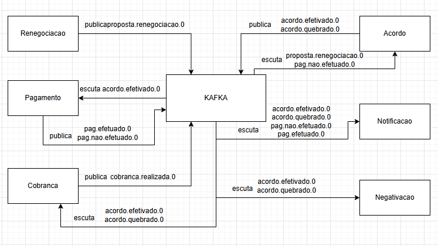

# Arquitetura de Microsserviços - Serviço de Notificação

Este documento descreve o funcionamento do serviço **Notificacoes** dentro de uma arquitetura de microsserviços baseada em eventos, utilizando o padrão Saga com coreografia. A comunicação entre os serviços é realizada por meio de tópicos Kafka.

## Notificacoes

O serviço de notificação é responsável por toda comunicação ativa com o cliente, como e-mails, SMS. Sua principal função é garantir que o cliente esteja sempre informado sobre o status do processo de renegociação e seus desdobramentos.

## Como usar

### Requisitos

- [JDK 11 ou superior](https://adoptium.net/).
- [Docker](https://docs.docker.com/get-docker/) e [Docker Compose](https://docs.docker.com/compose/)
- [GIT](https://git-scm.com) (se for para clonar o projeto) ou baixar o zip.

### Rodando o projeto

1. Clone o repositório:
```bash
git clone https://github.com/RaafaRodrigues/notification.git
```

2. Navegue até o diretório do projeto:

```bash
cd notification
```

3. Suba os containers Docker:

```bash
docker-compose up -d
```

Isso iniciará a aplicação em segundo plano na porta 8081.

---

---
## Padrões usados no código

### 1 - Factory
* Usado para construção de objetos de acordo com o provedor e tipo de notificação.

---

### Eventos Consumidos

| Tópico               | Ação Executada                                                 |
|----------------------|----------------------------------------------------------------|
| `acordo.efetivado.0` | Envia confirmação do acordo para o cliente                    |
| `pag.efetuado.0`     | Informa o cliente sobre o recebimento do pagamento             |
| `pag.nao.efetuado.0` | Envia alerta de inadimplência, incentivando o pagamento       |
| `acordo.quebrado.0`  | Notifica que o acordo foi quebrado por falta de pagamento     |

### Payload esperado
```json
{
  "clientId": "12345",
  "clientName": "BPtHoXbjPb+wwH1FJ9FyNlU7kmv+UtflLfwVtZjW5hM=",
  "message": "Mw7dUch9ZKbs9Lszz1ffpBv/jGoBf5LF7dFi14mshpI=",
  "type": "EMAIL",
  "provider": "AWS",
  "details": {
    "type": "EMAIL",
    "destination": "ALv8ntE81wsZdpeybS+Sfg12aP3bAcFbcr1OOS0AFqcE=",
    "subject": "Wnxbr2YbmXzqUyAKpWsj0vjEY8jTxQW2Ih9R9nTzqdo4="
  }
}
```

* Onde os campos sensíveis são criptografados pelo serviço que publica as mensagens, e descriptografado pelo serviço de notificação.

### Exemplos de Notificações

- **Confirmação de Acordo:**
  > "Seu acordo de renegociação foi efetivado com sucesso. Confira os detalhes acessando sua conta."

- **Confirmação de Pagamento:**
  > "Recebemos seu pagamento. Obrigado por manter seu compromisso em dia."

- **Alerta de Inadimplência:**
  > "Detectamos que sua parcela não foi paga até a data de vencimento. Regularize o quanto antes para evitar penalidades."

- **Quebra de Acordo:**
  > "Infelizmente seu acordo foi cancelado devido à ausência de pagamento. Seu nome poderá ser negativado novamente."

### System design como um todo


---
## Ferramentas usadas para auxilio de qualidade e codigo
* Sonar.
* Adicionado configurações para coverage de codigo utilizando o jacoco.
* Adicionado spotless para formatação e validação do codigo.
---

### Considerações Técnicas
- O envio é via algum provedor por exemplo (AZURE, AWS, GRCP etc.).
- Implementa mecanismos de retry para falhas temporárias.

### Documentações de referência

* [Documentação oficial do Gradle](https://docs.gradle.org)
* [Guia de Referência do Plugin Gradle do Spring Boot](https://docs.spring.io/spring-boot/3.4.4/gradle-plugin)
* [Criar uma imagem OCI](https://docs.spring.io/spring-boot/3.4.4/gradle-plugin/packaging-oci-image.html)
* [Spring Boot DevTools](https://docs.spring.io/spring-boot/3.4.4/reference/using/devtools.html)
* [Spring para Apache Kafka](https://docs.spring.io/spring-boot/3.4.4/reference/messaging/kafka.html)

### Links adicionais

Essas referências adicionais também podem te ajudar:

* [Gradle Build Scans – insights sobre o build do seu projeto](https://scans.gradle.com#gradle)


